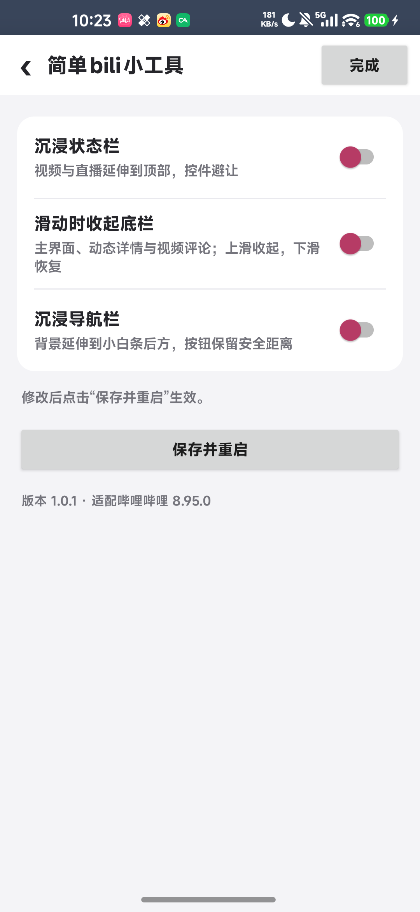

# 简单bili小工具 1.0.1 实机验证

日期：2026-10-04。包名 `com.weinaoa.easybilitool`，versionCode 2，versionName 1.0.1。

## 结果与修复

实机验证通过，最终 APK 已安装到 umi。测试发现初版 1.0.0 的设置编辑器使用哔哩哔哩的主题 Activity 获取 SharedPreferences，会被宿主重定向，导致开关表面保存成功、重启后仍关闭。

1.0.1 将读取与写入统一到 `createPackageContext("tv.danmaku.bili", 0)` 获得的普通宿主上下文，继续使用独立配置文件 `com.weinaoa.easybilitool.settings.xml`。保存后逐次检查私有目录中的三个布尔键，并确认宿主进程 PID 更换；最终五组实机配置均保持到重启后。

最终安装包与构建 APK 逐字节一致，SHA-256：

```text
7777bae88ae8867a8dab9b41c383e8339d0172c9e09b36f2f8105e5d15649e48
```

## 环境与方法

- 手机：小米 10，设备代号 umi，Android 17 / API 37，1080×2340，字体倍率 1.1，手势导航。
- 宿主：官方哔哩哔哩 8.95.0（8950600），Root / LSPosed，libxposed API 102。
- 为避免冲突，在 LSPosed 管理器关闭 `com.weinaoa.bilitool`，启用 `com.weinaoa.easybilitool`，简单版作用域只有 `tv.danmaku.bili`。框架数据库只作备份和读取核对，启停通过管理器完成。
- 通过 ADB 在指定 umi 操作实际界面，临时 UiAutomation 工具读取窗口及原生控件 bounds，保存截图，并结合实际配置 XML 和进程重启核对结果。
- 实机配置覆盖：全部关闭、仅状态栏、仅底栏收起、仅导航栏、三个全部开启。剩余组合由 JVM 配置测试覆盖，不能视为实机验证。

## 实机检查

| 检查 | 结果 |
| --- | --- |
| 模块桌面入口、宿主设置入口、名称与版本 | 通过；宿主只出现简单版模块入口，设置仅含三个开关 |
| 默认值、草稿、未保存提示、继续编辑、放弃修改 | 通过；初始三个开关关闭，放弃后不修改已保存值 |
| 保存并重启 | 通过；保存值写入普通私有配置文件，进程重启后仍保持 |
| 首页、关注、会员购、我的底栏 | 通过；上滑隐藏原生底栏，下滑恢复 |
| 动态详情底栏 | 通过；正文滑动隐藏/恢复，退出后重新进入恢复显示 |
| 视频评论底栏 | 通过；隐藏/恢复，简介与评论切换后恢复显示 |
| 视频沉浸状态栏 | 通过；顶部原生菜单固定保留 80px 偏移，横屏全屏往返后仍正确 |
| 直播沉浸状态栏 | 通过；背景延伸到顶部，原生头部避让状态栏；输入框打开/退出后恢复 |
| 主界面、动态、视频评论沉浸导航栏 | 通过；背景延伸到导航区域，原生操作控件保留安全位置；收起开关关闭时滑动不隐藏底栏 |
| 直播与设置沉浸导航栏 | 通过；底部背景延伸、顶部保持独立；直播及视频输入框退出后恢复 |
| 三个开关同时开启 | 通过；主界面/动态/视频评论底栏收起与导航安全区共同正常，视频保持 80px 偏移，直播顶部与底部同时沉浸 |

部分可重复核对的物理像素 bounds：

| 原生控件 | 全部关闭 | 对应开关开启 |
| --- | --- | --- |
| 主界面底栏 | `[0,2102][1080,2285]` | 导航栏：`[0,2102][1080,2340]`，标签位置保留 |
| 视频评论底栏 | `[0,2164][1080,2285]` | 导航栏：`[0,2164][1080,2340]`，内部输入控件保持安全位置 |
| 视频顶部菜单 | `[0,90][1080,244]` | 状态栏：`[0,80][1080,234]`，全屏往返后相同 |
| 直播背景根布局 | `[0,90][1080,2285]` | 仅状态栏：`[0,0][1080,2285]`；仅导航栏：`[0,90][1080,2340]`；同时开启：`[0,0][1080,2340]` |
| 直播原生头部 | `[0,90][1080,338]` | 三种沉浸配置均保持 `[0,90][1080,338]` |

测试结束时的设置页：



## 本地与包体核对

- 修复后 JVM 回归 **69 项通过**，覆盖配置八种组合、草稿、首页/详情滚动状态与 Hook 异常回退。
- `assembleDebug`、`lintDebug` 成功：**0 errors、18 warnings**，详情见 `build-v101.log`。提示来自内部 API/资源访问、目标 SDK 和数据提取规则。
- `apksigner verify --verbose --print-certs` 通过，v2 本机 Android 调试签名。
- APK 入口、名称、版本、作用域、DEX 类定义与字符串核对通过。自有源码为 24 个 Java 文件，没有其他原模块功能或旧包名；libxposed API 未打入 APK，没有额外权限或 provider。AGP 自动附带的 Kotlin 运行库、注解及 R8 生成代码属于构建运行支持。详见 `apk-audit.json`。
- 最终宿主进程的模块日志未出现设置读取、Hook 回调或不支持回退错误，AndroidRuntime 未出现致命异常。Android 17 的可选 `android.widget.ScrollView` 挂钩提示 unavailable；本次页面实际使用的 RecyclerView / NestedScrollView 滚动路径已通过上述操作验证。
- 源码 ZIP 只包含独立项目、资源、编译依赖、Gradle wrapper、测试和验证文档。排除完整版项目、临时实机工具、构建缓存、local.properties、设备配置备份和账户页面截图。

## 测试结束状态与范围

- 简单版 1.0.1 保持安装且启用；原 Bili 小工具保持关闭，避免冲突。其他模块的启用状态及作用域未改变。
- 三个测试开关恢复到测试前的关闭状态；原模块的两份配置、字体倍率、旋转设置和系统息屏时间未改变。
- 临时实机检查应用及本次设备截图/XML 临时文件已移除。手机停留在简单版设置页，已确认 `mWakefulness=Awake`，没有执行息屏操作。
- 仅验证上述 umi、宿主版本与手势导航环境；没有实测三键导航、画中画、分屏、其他 Android/宿主版本或全部页面入口。
