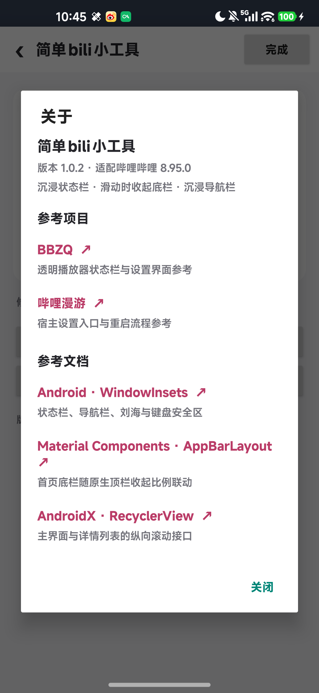

# 简单bili小工具 1.0.2 关于页验证

日期：2026-10-04。包名 `com.weinaoa.easybilitool`，versionCode 3，versionName 1.0.2。

## 本次修改

桌面介绍页与哔哩哔哩内的功能设置页均增加“关于”入口，使用同一个可滚动对话框展示版本、三个功能及参考项目/文档。各来源列出对应参考范围，可点击打开链接。

| 来源 | 对应范围 |
| --- | --- |
| [BBZQ](https://github.com/HSSkyBoy/BBZQ) | 透明播放器状态栏与设置界面参考；依据原项目 README 0.8.1/0.8.3 与验证记录核对 |
| [哔哩漫游](https://github.com/yujincheng08/BiliRoaming) | 宿主设置入口与重启流程参考；沿用原项目关于页的来源记录 |
| [Android WindowInsets](https://developer.android.com/reference/android/view/WindowInsets) | 状态栏、导航栏、刘海与键盘安全区接口文档 |
| [Material Components AppBarLayout](https://developer.android.com/reference/com/google/android/material/appbar/AppBarLayout) | 首页底栏随原生顶栏收起比例联动的接口文档 |
| [AndroidX RecyclerView](https://developer.android.com/reference/androidx/recyclerview/widget/RecyclerView.OnScrollListener) | 主界面与详情列表的纵向滚动接口文档 |

本次新增 `About.java`，原有 Java 文件只修改 `SettingsActivity.java` 与 `InAppSettings.java` 的入口按钮。逐文件对照 1.0.1 源码 ZIP，其余 Java 文件保持一致；三个功能、配置字段和保存方式没有调整。关于页没有开源许可栏目。

## 验证结果

- `assembleDebug` 与 `lintDebug` 成功，**0 errors、18 warnings**，见 `build-v102.log`。
- APK 名称、包名、版本、API 102 入口、作用域与 DEX 核对通过；自有 Java 源码共 25 个文件。没有增加权限或 provider；没有旧包名及被移除的功能代码。详情见当前 `apk-audit.json`。
- `apksigner verify --verbose` 通过，采用 v2 Android 调试签名。
- 在 umi / Android 17 / 哔哩哔哩 8.95.0 / 字体倍率 1.1 实际打开桌面与宿主内两处“关于”，五个来源均显示完整，文字自然换行，关闭按钮可操作。
- 点击桌面关于页的 BBZQ，Via 浏览器显示该仓库的 GitHub 页面标题；返回后可正常关闭对话框。其余链接地址通过对应官方页面核对，没有逐个在手机浏览器中打开。
- 在宿主设置中修改未保存的“沉浸状态栏”，打开并关闭“关于”后，开关草稿保持；私有配置文件仍为原值。选择“放弃修改”后重新进入，三个开关仍全部关闭。
- 最终安装 APK 与构建文件逐字节一致；宿主进程日志未出现 AndroidRuntime 致命异常。临时检查应用及设备截图/XML 临时文件已移除。
- LSPosed 中原模块继续关闭，简单版继续启用，作用域只有 `tv.danmaku.bili`。手机停留在宿主内“关于”，确认 `mWakefulness=Awake`，未执行息屏操作。

最终 APK SHA-256：

```text
eeb2459d2811e89d6aea31852069cb7582e01e7ffee04fda4dc68aee218977de
```

本次实机截图：



本轮验证针对关于页及设置草稿往返，三个功能的完整实测记录仍见 [VALIDATION-v101.md](VALIDATION-v101.md)。未增加其他设备、客户端版本或系统主题的实测保证。
