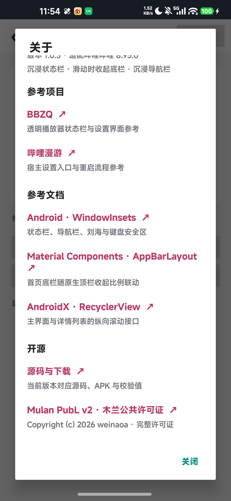

# 简单bili小工具 1.0.3 开源发布验证

日期：2026-10-04。包名 `com.weinaoa.easybilitool`，versionCode 4，versionName 1.0.3。

本版本加入 Mulan PubL v2 完整双语主许可证、自有源文件声明、APK 内的主许可证及第三方许可副本，以及“关于”中的当前版本对应源码和许可证链接。原五个参考来源仍保留。

## 许可与项目文件

- 根目录 `LICENSE` 与维护方发布的完整文本逐字节一致，不采用旧简化副本。自有源文件填写 Copyright (c) 2026 weinaoa 与 Mulan PubL v2 声明；第三方 Apache-2.0 材料继续保留各自许可。
- 两个工程已改为并列目录、独立 Git 仓库，先分别上传私有备份。BiliTool 仅为私有备份，简单版公开仓库的文件树不包含完整版代码或设备归档。
- 在源码和暂存文件中检查本机配置、构建缓存、密钥、常见访问令牌及设备备份；这些材料不进入提交或公开源码 ZIP。
- 去除新许可注释后，除 `About.java` 外的全部模块 Java 文件与 1.0.2 备份提交一致；三个功能与配置逻辑没有修改。

## 本地验证

- `assembleDebug` 与 `lintDebug` 成功：0 errors、18 warnings。
- JVM 检查 69 项通过：配置/草稿/首页联动 24、主界面滚动 13、详情滚动 17、现代 Hook 与反射 15。
- APK 审计通过：25 个自有 Java 文件，正确的名称、包名、版本与 API 102 入口，作用域只有 `tv.danmaku.bili`，没有新增权限/provider、被移除的功能或旧模块包名。
- API JAR 未打入 APK；完整主许可证、第三方声明和 Apache-2.0 文本均已打入 APK，内容与项目文件一致。v2 调试签名验证通过。

## 实机检查

设备仍为 umi / 小米 10、Android 17 / API 37、官方哔哩哔哩 8.95.0、字体倍率 1.1、手势导航。

- 1.0.3 已覆盖安装，安装文件与审计构建逐字节一致。
- 桌面和宿主设置两处“关于”均实际打开并滚动检查，版本、五个参考来源、当前版本源码链接和完整许可证入口可见，许可名称与版权说明完整显示。
- 原 BiliTool 在 LSPosed 保持关闭，简单版保持启用，作用域仅哔哩哔哩。三个开关保持关闭，本次没有修改配置。
- 本次只对开源入口与许可做实机检查，三个功能的完整实测范围仍见 [VALIDATION-v101.md](VALIDATION-v101.md)。

本次宿主关于页截图：



APK SHA-256：

```text
43cc717d077f9687ecbc4dfffa6efe8f0f15630d66df6e66335c760d5e1ffea6
```
